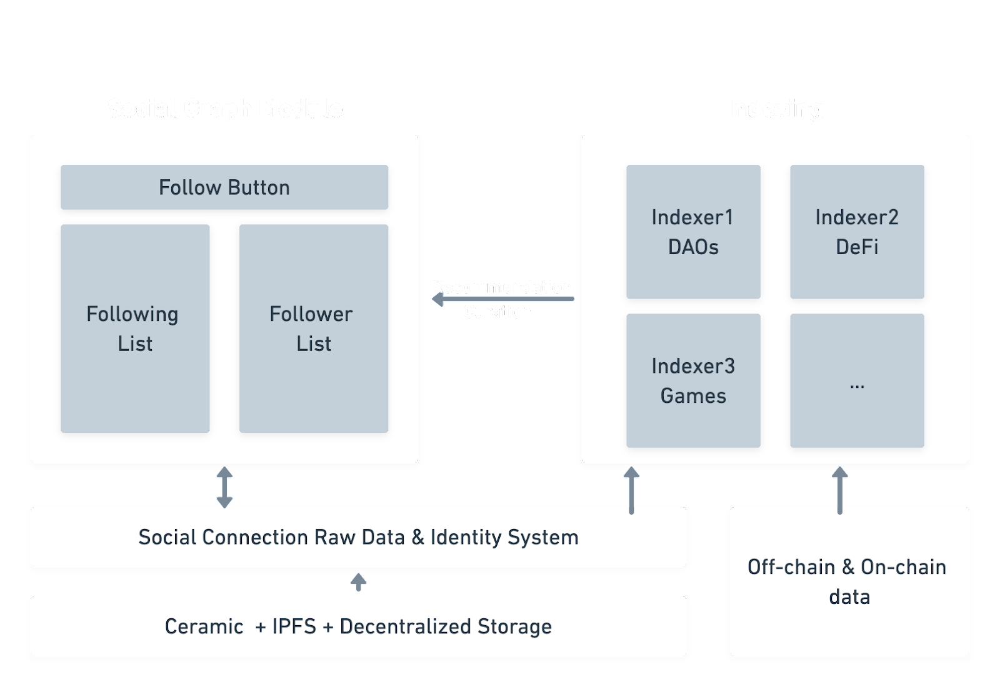

# CyberConnect Indexer

## High-level Use of CyberConnect Indexer

We introduce how to mutate(follow and unfollow) a connection status between addresses in [JavaScript SDK](./installation) and [CyberConnect Button](./follow_button) sections. In this section, we will guide you how to query connection data and get potential relationship recommendations from CyberConnect Indexer.

CyberConnect Indexer collects on-chain data from IPFS and blockchain networks, and off-chain data from platforms. Then, it aggregates, transforms, and stores raw data into local relational and graph databases. After deployment, Indexer can perform address identity curation and connection recommendation to Social Graph Module in user-end applications.

## Architecture of CyberConnect Indexer

The CyberConnect Indexer can be divided into four parts: Processor, Aggregator, Recommender and Querier. Each of them processes data sequentially in a pipelined fashion and we will introduce each part in this order.

The Processor aims to index raw data from IPFS network, blockchain networks like Ethereum, Solana and fetch off-chain data from platforms like Rarible, Twitter, NFTBank and etc. The Processor will store fetched and indexed data in relational databases like MySQL, PostgreSQL. 

The Aggregator reads data written by the Processor in relational databases, transforms and stores them into graph databases like Neo4j, TigerGraph, waiting for Recommender and Querier to use.

The Recommender adopts both unweighted(popularity in the whole network, etc.) and weighted(asset based, action based, etc.) recommendation algorithm when analyzing potential relationships and making recommendations. It also supports customizable recommendation algorithm based on the host’s needs.

The Querier serves in three main purposes: providing identity data, relationship data and connection recommendations. It retrieves data from both relational databases and graph databases, gets recommendation results from the Recommender and returns data in the way the user requested. 

## Data Retrieval

CyberConnect Indexer uses GraphQL as the query language for data retrieval. You can query address identity information and get recommendations through Indexer’s GraphQL endpoint. In the next page, we will start with [getting an address’ identity](./identity).

