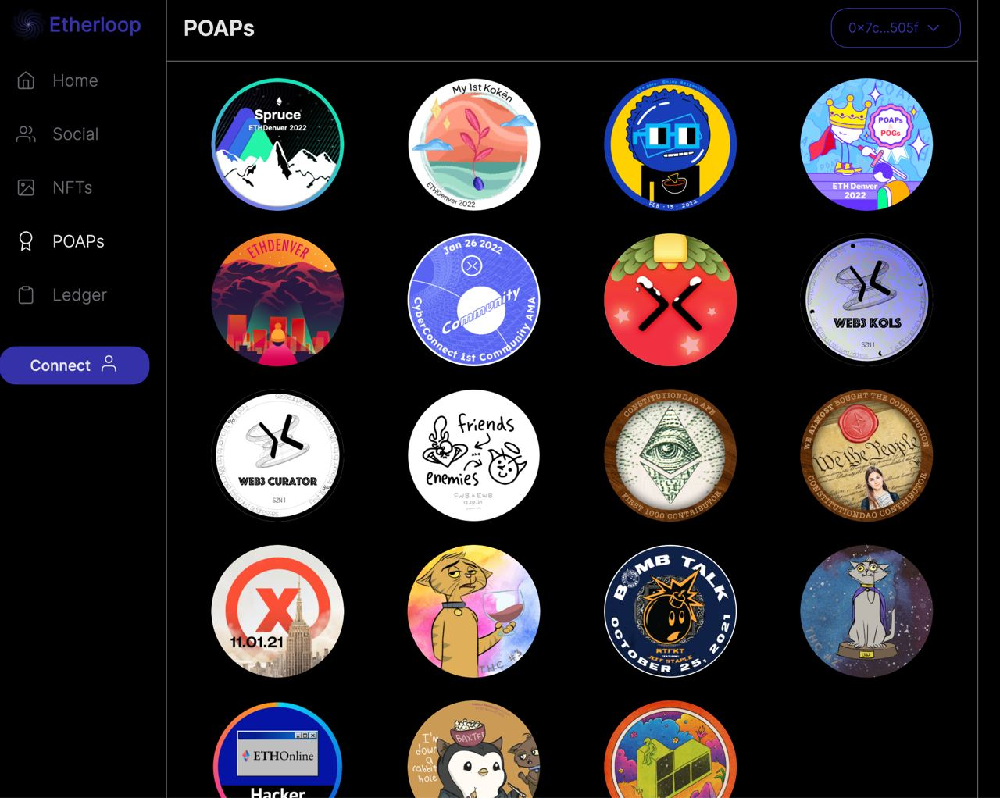

# Etherloop

Etherloop is a social web app that allows users to connect with fellow addresses and keep track of balances, tokens, transactions, POAPs and NFTs that take place on top of the Ethereum network.

Etherloop integrated CyberConnect’s Follow button to establish connections between users.
