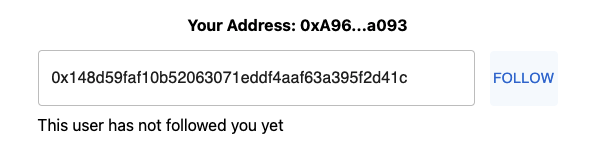

# Get Started

CyberConnect offers three ways to interact with: using CyberConnect JavaScript SDK, embedding a CyberConnect Button, and querying CyberConnect Indexer GraphQL endpoints. You can follow or unfollow one address through SDK or CyberConnect Button and query the result by Indexer endpoints.

For details of three integration methods, please check [JavaScript SDK](./Apis/installation), [CyberConnect Indexer](./Apis/about_indexer) and [CyberConnect Button](./Apis/follow_button) sections.

## CyberConnect Starter Project

We will go through the integration using the CyberConnect starter project. You can download, run and change the code freely from our [Github repo](https://github.com/cyberconnecthq/cyberconnect-starter).

### Environment Setup

Before starting, please make sure you have installed [NodeJS](https://nodejs.org/en/) and [MetaMask Chrome Extension](https://metamask.io/) on your computer.

```bash
node --version
```

In your terminal, clone the repo:

```bash
git clone git@github.com:cyberconnecthq/cyberconnect-starter.git
cd cyberconnect-starter
```
The starter project is built based on [React](https://reactjs.org/), [Next.js](https://nextjs.org/). Once finished downloading, the project directory should look like this:

```bash
├──public
├──src
│   ├──components
│   ├──context
│   ├──pages
│   └──utils
├──styles
├──package.json
├──README.md
├──... (many other files and folders)
└──next.config.js
```

Source files can be found in `src` folder. They are categorized into `components`, `context`, `pages` and `utils` folders according to their types.

### Installation and Run Locally

In the `package.json`file, the dependencies that will be used for this demo are all well listed. You can simply run the following to install them.

```bash
npm install
# Or, you can also use yarn if you prefer
yarn
```

Next, we can run the project locally 

```bash
npm run dev
# or
yarn dev
```

### Quick Intro to Code

CyberConnect starter project uses CyberConnect JavaScript SDK to mutate connection status between addresses and CyberConnect Indexer GraphQL APIs to query.

In `src/context/web3Context.tsx`, you can see how `cyberConnect` object is initialized:

```js
const initCyberConnect = useCallback((provider: any) => {
  const cyberConnect = new CyberConnect({
    provider,
    namespace: 'CyberConnect',
  });

  setCyberConnect(cyberConnect);
}, []);
```

And writing the connection to the decentralized network only takes one line of code with CyberConnect SDK. In `src/pages/index.tsx`:

```js
await cyberConnect.connect(searchInput);
```

It will be executed when the correct format of address input is given, a follow button is clicked, and the user has the request signed.

Querying the friend list is implemented by calling GraphQL APIs. You can see the related code in `src/utils/query.ts`:

```js
const resp = await handleQuery(schema, endPoint);
```

### Explore the Project

Now, open the browser and set the URL as [http://localhost:3000](http://localhost:3000). You can see the project page:


Click "CONNECT WALLET" button, and select the address that you want to use for this demo. Then, click "Next". 


You will see a page where you can follow and unfollow new users, check your follower and following list. 


We use `cyberlab.eth` for demonstration. Input the address `0x148d59faf10b52063071eddf4aaf63a395f2d41c` of `cyberlab.eth`, and click follow button. 



A signature request from MetaMask will show up.


After confirming the signing operation, you now have your first following on CyberConnect!


## Conclusion and Next Step

That's it!!👏👏👏  You just finished a quick integration with CyberConnect successfully! You can make more experiments and build your project on top of this starter project. 

You can also visit CyberConnect [Main Site](https://app.cyberconnect.me). Basically, it uses the same implementation way as this starter project and has more interesting features.

For the next steps, you can continue reading about [CyberConnect Indexer](./Apis/about_indexer) and [CyberConnect SDK](./Apis/installation).
