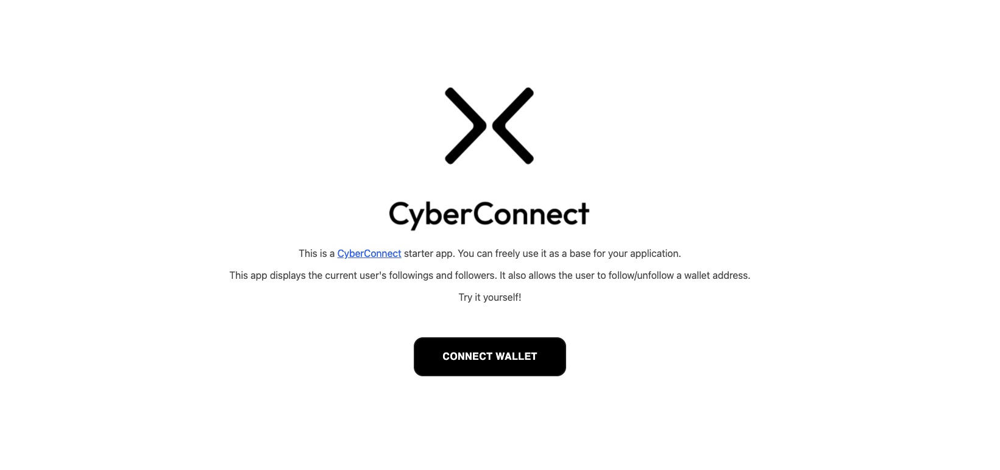
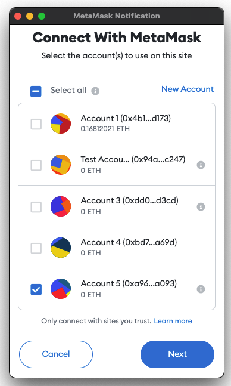
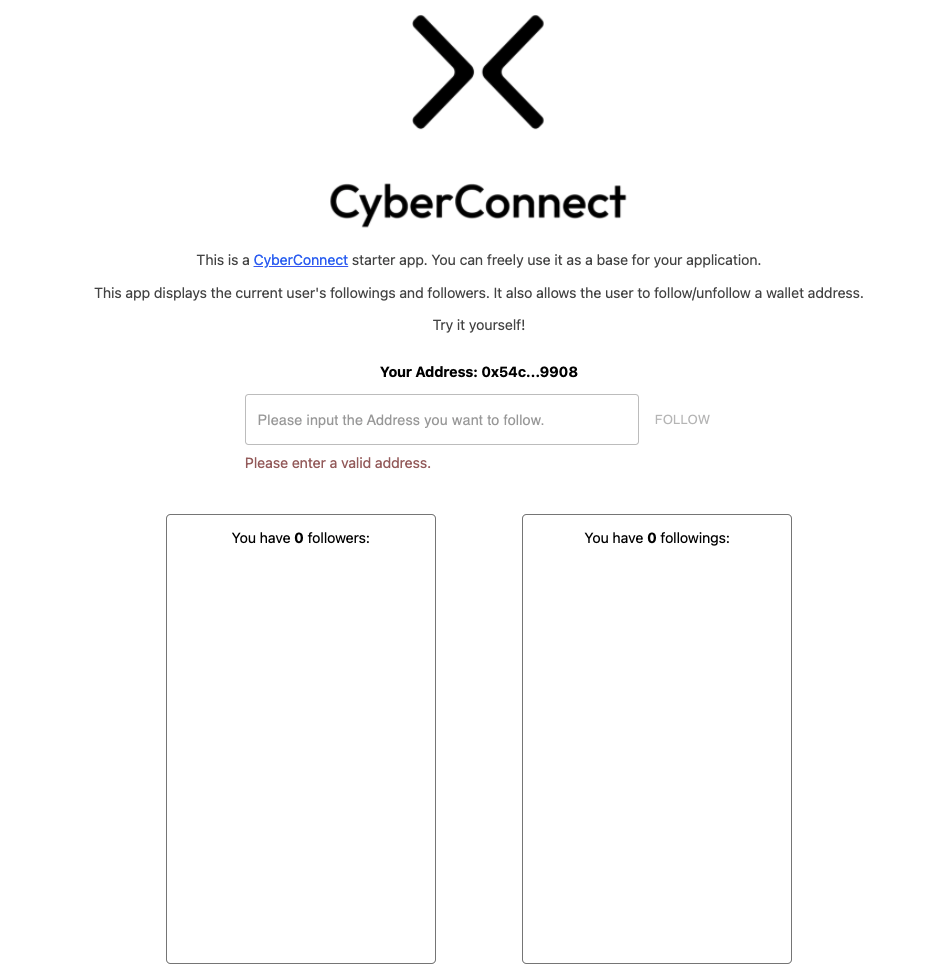
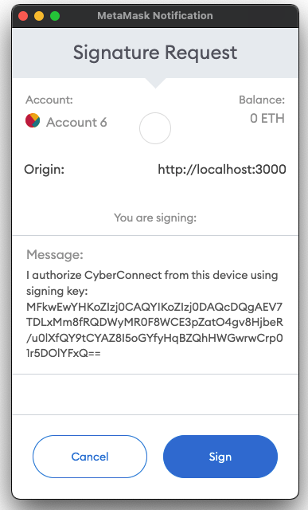
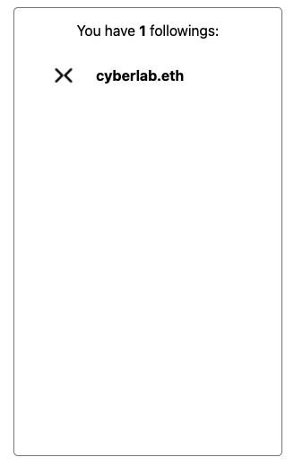

# Get Started

CyberConnect offers three ways to get integrated: querying CyberConnect Indexer GraphQL endpoints, embedding a CyberConnect Button or using CyberConnect JavaScript SDK. In this article, we will use CyberConnect JavaScript SDK for demonstration. 

In this article, we will go through CyberConnect integration ways by using the CyberConnect starter project. You can download, run and change the code freely from [Github repo](https://github.com/cyberconnecthq/cyberconnect-starter).

For details of all three ways of integration, please check [JavaScript SDK](./Apis/installation), [CyberConnect Indexer](./Apis/about_indexer) and [CyberConnect Button](./Apis/follow_button) sections.

## CyberConnect Starter Project

### Environment Setup

Before starting, please make sure you have installed [NodeJS](https://nodejs.org/en/) and [MetaMask Chrome Extension](https://metamask.io/) on your computer.

```bash
node --version
```

In your terminal, clone the repo:

```bash
git clone git@github.com:cyberconnecthq/cyberconnect-starter.git
cd cyberconnect-starter
```

### Structure of the Project

The project directory should look like this:
```bash
├──public
├──src
│   ├──components
│   ├──context
│   ├──pages
│   └──utils
├──styles
├──package.json
├──README.md
├──... (many other files and folders)
└──next.config.js
```

All source files can be found in `src` folder. They are categorized into `components`, `context`, `pages` and `utils` folders depending on their types.

`styles` folder defines the global style of the project. `package.json` lists all dependencies of this project. `next.config.js` is the configuration file for Next framework. `public` folder hosts public assets of the project.

### Quick Intro to Code

CyberConnect starter project uses CyberConnect JavaScript SDK to mutate connection status between addresses and CyberConnect Indexer GraphQL APIs to query.

In `src/context/web3Context.tsx`, you can see how `cyberConnect` object is initialized:

```js
const initCyberConnect = useCallback((provider: any) => {
  const cyberConnect = new CyberConnect({
    provider,
    namespace: 'CyberConnect',
  });

  setCyberConnect(cyberConnect);
}, []);
```

And writing the connection to the decentralized network only takes one line of code with CyberConnect SDK. In `src/pages/index.tsx`:

```js
await cyberConnect.connect(searchInput);
```

It will be executed when the correct format of address input is given, a follow button is clicked, and the user has the request signed.

Querying the friend list is implemented by calling GraphQL apis. You can see the related code in `src/utils/query.ts`:

```js
const resp = await handleQuery(schema, endPoint);
```
### Installation and Run Locally

The starter project is built based on [React](https://reactjs.org/), [Next.js](https://nextjs.org/). In the `package.json` file, the dependencies that will be used for this demo are all well listed. You can simply run the following to install them.

```bash
npm install
# Or, you can also use yarn if you prefer
yarn
```

Next, we can run the project locally 

```bash
npm run dev
# or
yarn dev
```

### Explore the Project

Now, open the browser and set the URL as [http://localhost:3000](http://localhost:3000). You can see the project page:



Click "CONNECT WALLET" button, and select the address that you want to use for this demo. Then, click "Next". 



You will see a page where you can follow and unfollow new users, check your follower and following list. 



We use `cyberlab.eth` as demostration. Input the address `0x148d59faf10b52063071eddf4aaf63a395f2d41c` of `cyberlab.eth`, and click follow button. 



After confirmation of signing operation, you can now have your first following on CyberConnect!



:::tip

If you encounter any issue in the above section, you can join our discord, raise your question in the Developer channel. 

:::

## Conclusion and Next Step

That's it!!👏👏👏  You have finished a quick integration with CyberConnect successfully! You can make more experiments and build your project on top of this starter project. 

You can also visit CyberConnect [Main Site](https://app.cyberconnect.me). Basically, it uses the same implementation way as this starter project and has more interesting features. Invite your friends to follow each other on CyberConnect and join the CyberConnect developer community!

Your next step can be to continue reading about [CyberConnect Indexer](./Apis/about_indexer) and [CyberConnect SDK](./Apis/installation). You can fetch the list of followers and followings through indexers GraphQL APIs. 
